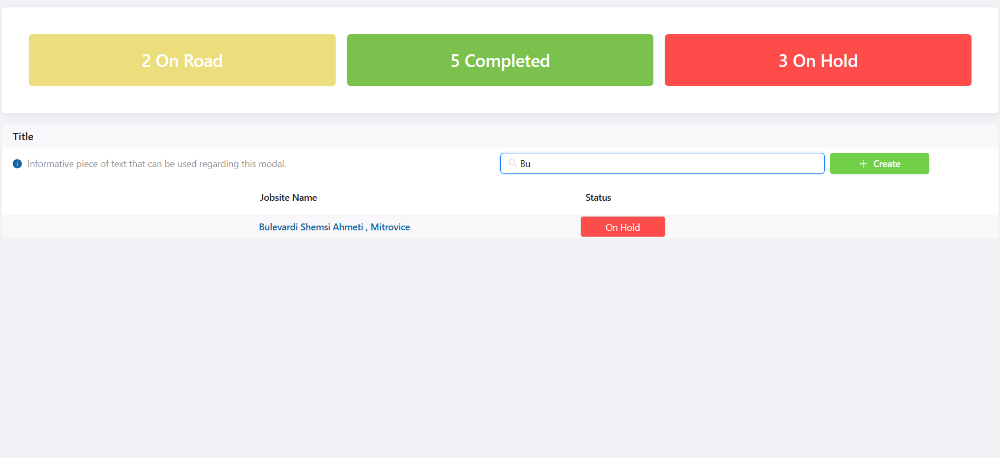

⚙️ Setup & Running Locally

Clone Repository

git clone https://github.com/<your-username>/<repo-name>.git
cd <repo-name>/react-test

Install Dependencies

npm install

Run Development Server

npm start

The app will run on http://localhost:3000

Run Tests

npm test

## 📸 Screenshots

### Job Sites List

### Search Functionality in Job Sites List

### Create Job Site Modal

### Options in Modal

### Inventory Dashboard

### Inventory Dashboard with Table

### Inventory Dashboard Search Functionality

### Edit Modal in Inventory Dashboard

Additional questions :

1.How might you make this app more secure?

There are several layers of security that could be applied to this application:

Authentication & Authorization – Implement a secure login system (e.g., JWT-based auth or OAuth2). Users should only be able to view or modify job sites and inventory if their role permits it. Role-based access control (RBAC) ensures that, for example, only managers can edit or delete inventory items while regular employees may only view them.

Input Validation & Sanitization – All user inputs (search queries, job site names, item updates) should be validated both on the frontend and backend. This prevents malicious inputs that could cause XSS, SQL injection, or other injection-based attacks.

Secure Communication – Enforce HTTPS for all requests between the client and server so sensitive data (like inventory updates or user credentials) is encrypted in transit.

API Security – Protect APIs with rate limiting, request validation, and possibly API keys or tokens. This prevents abuse, brute-force attempts, and unauthorized access.

Audit Trails & Logging – Track who made which changes to inventory items and job sites. Having logs ensures accountability and makes it easier to detect suspicious behavior.

Least Privilege Principle – Ensure services, users, and APIs only have access to what they absolutely need. This reduces the impact of a compromised account or service.

2.How would you make this solution scale to millions of records?

To handle very large datasets efficiently, both frontend and backend need optimizations:

Pagination & Infinite Scrolling – Instead of loading all job sites or inventory items at once, records should be fetched in chunks (server-side pagination). Infinite scrolling or “Load More” buttons improve performance and user experience.

Server-Side Search & Filtering – Searching and filtering should be performed by the database, not the client. This ensures only the relevant records are sent to the frontend. Proper indexing on frequently queried fields (e.g., job site name, status, category) drastically improves query speed.

Caching – Use an in-memory cache like Redis for frequently accessed queries (e.g., job sites list, recently updated items). Caching reduces database load and speeds up responses.

Database Optimization – Optimize schema design, normalize where needed, and denormalize for performance-critical queries. Sharding or replication strategies may be required at very large scales.

Frontend Optimization – Use lazy loading for components and virtualized lists (e.g., React Virtualized) to render only visible rows when displaying thousands of records. This keeps the UI smooth.

Event-Driven Architecture – For very large-scale systems, consider breaking the app into microservices and using a message broker (e.g., Kafka, RabbitMQ) to handle updates asynchronously without blocking user operations.

Horizontal Scaling – Deploy backend services with load balancing across multiple servers/containers so the system can handle spikes in traffic or large numbers of concurrent users.
